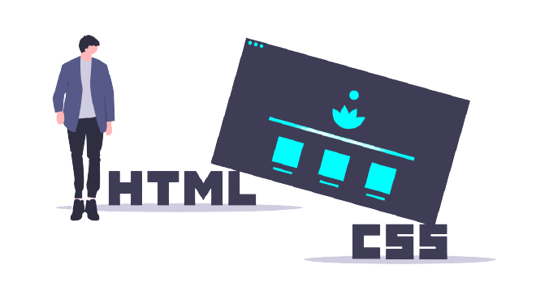

    <h1 align="center">Ei, obrigado pela sua visita! 🎈</h1>
    
    
 
        
📌 Olá, me chamo Eduardo Fonseca. Sou <strong>Desenvolvedor Front-end</strong>.

        
🧠 Habilidades: <strong>HTML</strong>, <strong>CSS</strong>, <strong>JavaScript</strong>.

        
💼 Ferramentas: <strong>VSCode</strong>, <strong>Canva</strong>, <strong>Notion</strong>, <strong>Git</strong> e <strong>GitHub</strong>.

        
💌 Se você deseja bater um papo comigo, não hesite em me enviar uma mensagem.

        

        
        
     

