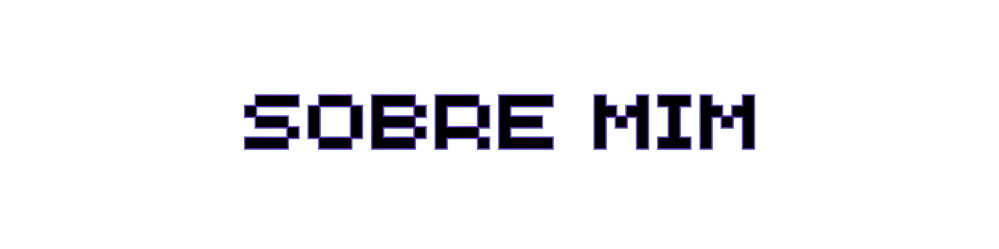
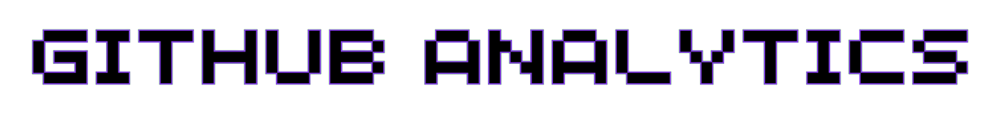
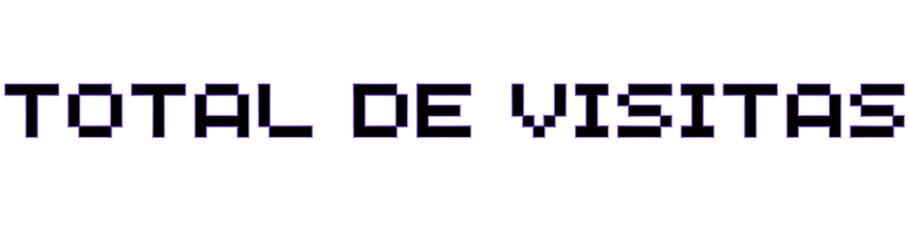

    

    

    	
    

	

		
📌 Ao longo do último ano, tenho me dedicado intensamente ao estudo do Desenvolvimento Web, aprimorando minhas habilidades no Front-end e almejando me tornar um desenvolvedor Full-Stack.

		
🧠 Possuo conhecimentos sólidos em HTML, CSS, ReactJS, NodeJS, Git e GitHub.

		
📚 Estou sempre em busca de aprendizado contínuo e evolução constante. Neste momento, estou entusiasmado com a perspectiva de explorar novas oportunidades.

		
💌 Sinta-se à vontade para entrar em contato comigo. Estou ansioso para receber sua mensagem!

		

			
		        
				
		

	

 

	
	

	 
	<picture>
	  <source
	    media="(prefers-color-scheme: dark)"
	    srcset="https://raw.githubusercontent.com/eduardzs/snk/output/github-contribution-grid-snake-dark.svg"
	  />
	  <source
	    media="(prefers-color-scheme: light)"
	    srcset="https://raw.githubusercontent.com/eduardzs/snk/output/github-contribution-grid-snake.svg"
	  />
	  
	</picture>

    

	 
	

 

        
