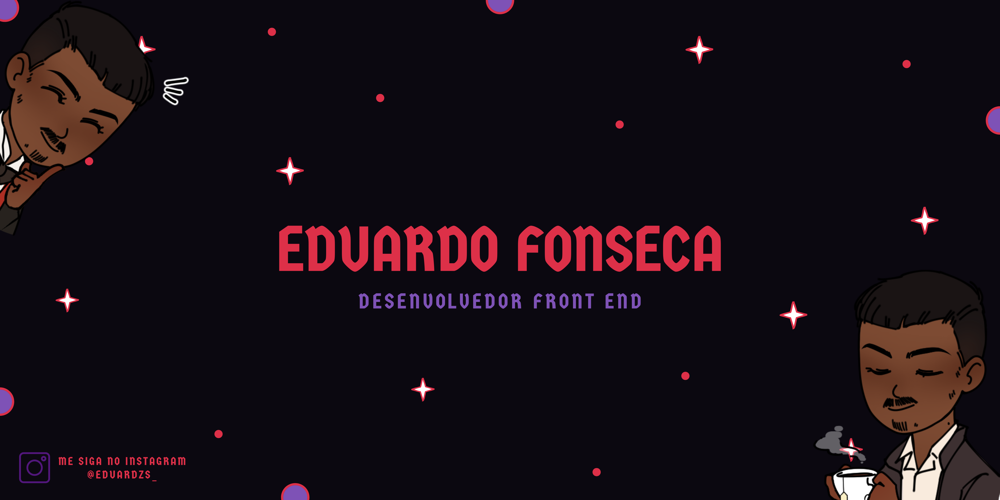
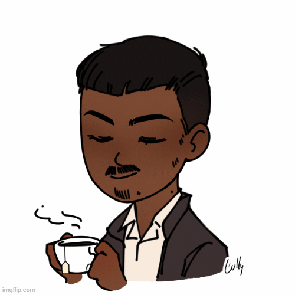

<h1>Ei, obrigado pela sua visita 😉</h1>

Meu nome é <strong>Eduardo Luiz Fonseca</strong>, nasci e cresci no <strong> Brasil </strong>, trabalho como desenvolvedor Front-end desde 2020 👨🏿‍💻. Meu hobby é aprender e resolver problemas, sempre pronto para novos desafios e mudanças totalmente fora da minha zona de conforto. 🧠

<strong>"You can do anything!" 🥇</strong>

<ul>
    <li>📍 Eu moro no <strong> Brasil </strong>, mais especificamente no estado de <strong> Minas Gerais.</strong></li>
    <li>👨🏾‍💻 A procura de uma vaga de emprego na área de <strong>Desenvolvimento Front-end.</strong></li>
    <li>👾 <strong>Criador de conteúdo</strong> tecnológico.</li>
</ul> 

<a href="https://github.com/eduardzs">

 

<h2>Skills 🤓 </h2>

  
  
  

 

<h2>Contatos 🖖🏾</h2>

<h2>Total de Visitas no Perfil 🕵🏾‍♂️</h2>

    

