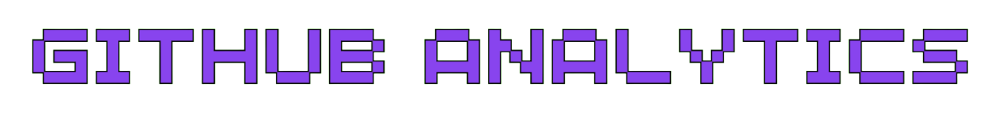
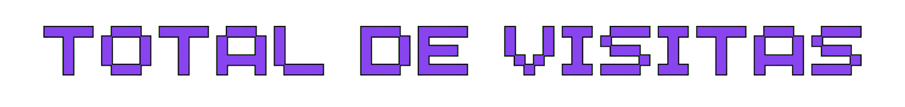

   

 

    

   

 

    

<h2>⭐ Front-end Developer</h2>

Sou um <strong>Desenvolvedor Web</strong> dedicado a criar soluções digitais que unem design elegante e funcionalidade eficaz. Com experiência em <strong>HTML</strong>, <strong>CSS</strong>, <strong>JavaScript</strong>, <strong>ReactJS</strong> e <strong>NodeJS</strong>, meu objetivo é evoluir continuamente e me tornar um <strong>Desenvolvedor Full-Stack</strong>.

    

Atualmente, estou cursando <strong>Análise e Desenvolvimento de Sistemas</strong> na <strong>Universidade UNINTER</strong>, o que está ampliando minhas habilidades técnicas e aprofundando meu conhecimento na área. Além disso, dedico tempo ao desenvolvimento de projetos pessoais e estudos independentes para me manter atualizado com as últimas tendências e tecnologias.
 

<h2>💡 O Que Eu Ofereço:</h2>

🚀 <strong>Desenvolvimento Front-End</strong>: Expertise em <strong>HTML</strong>, <strong>CSS</strong>, <strong>JavaScript</strong> e <strong>ReactJS</strong>, transformo designs criativos em interfaces web responsivas e intuitivas.

⚙️ <strong>Integração Full-Stack</strong>: Experiência com <strong>NodeJS</strong> para desenvolver soluções completas que integram <strong>Front-end</strong> e <strong>Back-end</strong> de forma eficiente.

🎨 <strong>Design e Experiência do Usuário</strong>: Foco em <strong>UX/UI Design</strong> para garantir que cada projeto proporcione uma experiência de usuário fluida e imersiva, com interfaces que não apenas funcionam bem, mas também sejam agradáveis, intuitivas e marcantes para quem as utiliza.

🛠️ <strong>Metodologias Ágeis e Melhores Práticas</strong>: Aplicação de práticas ágeis e padrões de codificação para garantir um desenvolvimento eficiente, com código limpo, bem estruturado e fácil de manter.

💻 <strong>Aprendizado Contínuo:</strong> Dedicação ao crescimento pessoal e profissional através de estudos independentes e projetos pessoais, mantendo-me atualizado com as últimas tendências e tecnologias.
 

<h2>🎯 Objetivos de Carreira:</h2>

🚀 <strong>Especialização Full-Stack:</strong> Busco aprofundar minhas habilidades para atuar como <strong>Desenvolvedor Full-Stack</strong>, integrando expertise em <strong>Front-end</strong> e <strong>Back-end</strong> para desenvolver soluções completas e eficientes.

📈 <strong>Crescimento Profissional:</strong> Estou empenhado em evoluir constantemente, explorando novas tecnologias e metodologias para melhorar minhas competências e enfrentar novos desafios com criatividade e eficiência.
 

<h2>🧠 Habilidades Técnicas:</h2> 

  
  
  
  
  
  
  
  
  
  
  
  
  
  
  

 

📬 Estou pronto para contribuir com minhas habilidades em equipes que valorizam inovação, aprendizado e colaboração. Vamos conversar?
 

    
    
    
    
    

 

   

 

    

 

    
       
    <picture>
        <source media="(prefers-color-scheme: dark)" srcset="https://raw.githubusercontent.com/eduardzs/eduardzs/output/pacman-contribution-graph-dark.svg">
        <source media="(prefers-color-scheme: light)" srcset="https://raw.githubusercontent.com/eduardzs/eduardzs/output/pacman-contribution-graph.svg">
        
    </picture>

   

 

     
      
    

